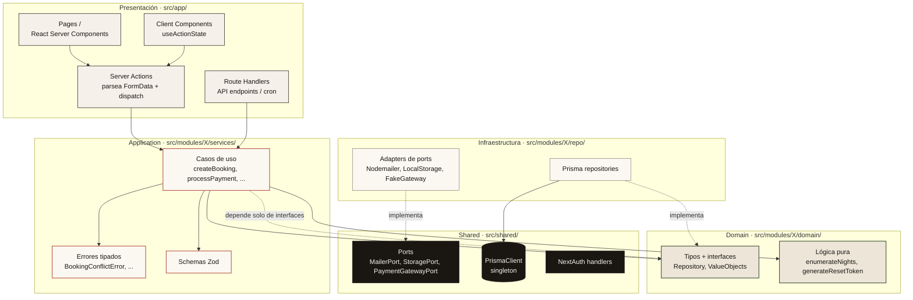

# Arquitectura en capas · Clean-Lite por bounded context

Cada módulo (`users`, `stays`, `bookings`, `payments`, `reviews`,
`notifications`) sigue el mismo layout interno. La regla de oro: los
imports solo van **hacia abajo** (presentación → application → domain),
nunca al revés.



## Reglas de no-negociables (del CLAUDE.md)

1. **Cross-module solo por `services/`** — un módulo nunca lee `repo/`
   o `domain/` de otro. Si bookings necesita datos de stay, llama a un
   service de stays (o, en lectura directa, query Prisma con cuidado).
2. **Prisma solo en `repo/`** — los services dependen de las interfaces
   del domain. Hace los tests posibles sin DB.
3. **Sin lógica de negocio en Actions** — la action parsea FormData,
   llama un service, retorna/redirige. Si hay aritmética o branching
   sobre estado de entidad, va en `services/`.
4. **Servicios externos detrás de ports** — nunca `import "stripe"` en
   un service. Solo en un adapter dentro de `repo/`.
5. **Money es `Decimal`** — nunca `Float`, ni en Prisma ni en TS.

## Composition root por módulo

Cada módulo tiene un `composition.ts` que arma las dependencias reales
(Prisma + adapters configurados por env). Las páginas/actions importan
ese helper en lugar de instanciar repositorios manualmente:

```ts
// src/modules/payments/composition.ts
export function paymentsDeps() {
  return {
    db: prisma,
    payments: new PrismaPaymentRepository(prisma),
    gateway: pickGateway(),       // fake o stripe según env
    receipts: new HtmlReceiptRenderer(),
    mailer: getMailer(),
  };
}
```

Esto hace que los tests pasen un objeto custom de deps (con fakes/mocks)
sin tocar nada más.
