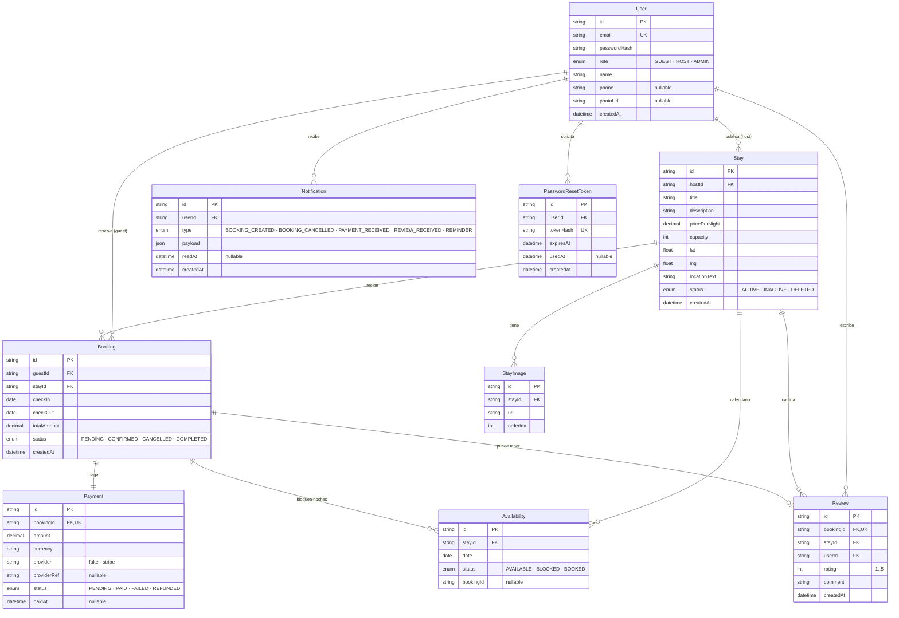

# Modelo Entidad-Relación · StayLocal

Los 8 ILF identificados en el PDF de estimación están mapeados 1:1 con
modelos Prisma en `prisma/schema.prisma`. Se añade `PasswordResetToken`
como detalle de implementación de CU-03 (no es un ILF nuevo, vive
dentro del ámbito de `User`).

## Constraints e índices críticos

| Constraint / índice | Tabla | Para qué |
|---|---|---|
| `UNIQUE(stayId, date)` | `Availability` | **Guard atómico de doble reserva** (ver ADR-0004) |
| `UNIQUE(bookingId)` | `Payment` | Un solo pago por reserva |
| `UNIQUE(bookingId)` | `Review` | Una sola reseña por reserva |
| `UNIQUE(email)` | `User` | Identidad |
| `UNIQUE(tokenHash)` | `PasswordResetToken` | Búsqueda eficiente del token al validar |
| `INDEX(guestId, status)` | `Booking` | Historial de reservas del huésped (CU-19) |
| `INDEX(stayId)` | `Review` | Promedio + lista en ficha (CU-25) |
| `INDEX(userId, readAt)` | `Notification` | Conteo de no leídas (bell del header) |

## Decisión sobre tipos

- **Dinero** siempre `Decimal` en Prisma (`@db.Decimal(10, 2)`), nunca
  `Float` — evita errores de redondeo en `pricePerNight × noches`.
- **Fechas de calendario** (`Availability.date`, `Booking.checkIn/Out`)
  como `@db.Date` (sin hora), normalizadas a UTC 00:00 en el dominio
  (`toUtcDate` en `src/modules/stays/domain/dates.ts`).
- **Token de recuperación** solo se guarda hasheado (SHA-256). El raw
  se envía por correo y nunca queda en la base.
