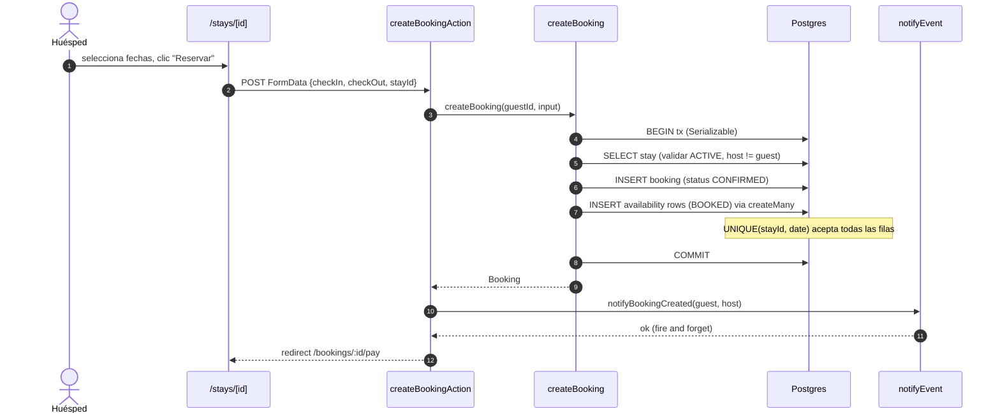
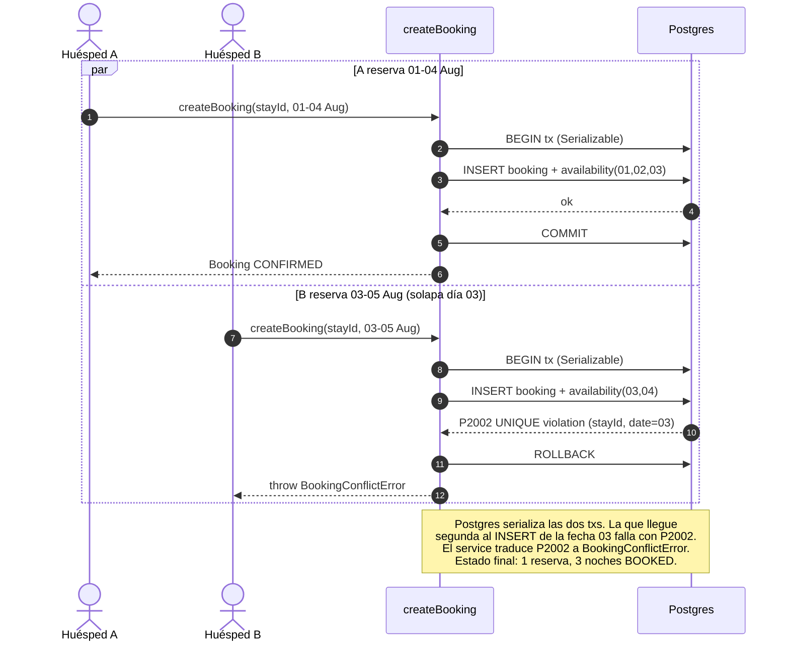

# Secuencia · CU-17 Realizar Reserva (con concurrencia)

Dos escenarios:

1. **Ruta feliz** — un huésped, las fechas están libres.
2. **Conflicto** — dos huéspedes reservan al mismo tiempo fechas que
   se solapan. La UNIQUE constraint en `Availability` actúa como lock
   atómico (ver ADR-0004).

## Ruta feliz

## Conflicto concurrente

## Garantías

- **Atomicidad**: si cualquier `INSERT` en `availability` falla, toda
  la tx hace rollback. No quedan bookings huérfanos.
- **No double-booking**: la UNIQUE constraint es física en la DB.
  Imposible de violar incluso con miles de requests concurrentes.
- **Verificable**: `tests/unit/bookings/create-booking.test.ts` ejecuta
  `Promise.allSettled([reservarA, reservarB])` y verifica que
  *exactamente uno* gana y la DB queda con 1 booking + N rows BOOKED.

## Referencias

- `src/modules/bookings/services/create-booking.ts`
- `tests/unit/bookings/create-booking.test.ts` — test concurrente
- ADR-0004 · UNIQUE como guard de doble reserva
