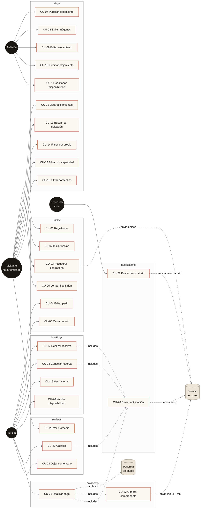

# Diagrama de Casos de Uso · StayLocal

Los 27 casos de uso del PDF de estimación, agrupados por módulo y por
actor. La numeración (CU-01..CU-27) y los pesos de complejidad
corresponden 1:1 con el documento `Estimacion_StayLocal.pdf`.

## Resumen por actor

| Actor | CU directos | Notas |
|---|---|---|
| Visitante (no autenticado) | 01, 02, 03, 05, 12-16, 25 | Cualquier acción que requiera identidad redirige a `/login` |
| Turista | 04, 06, 17-21, 23, 24 | Hereda lo del visitante |
| Anfitrión | 07-11 | Hereda lo del turista (un usuario puede ser ambos) |
| Cron | 27 | `POST /api/cron/reminders` con `Bearer CRON_SECRET` |

Las relaciones punteadas marcadas como `includes` indican efectos que
el sistema dispara automáticamente (notificaciones y comprobantes).
